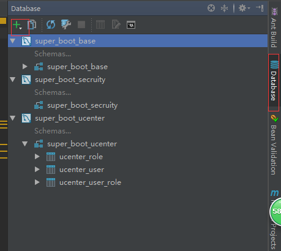
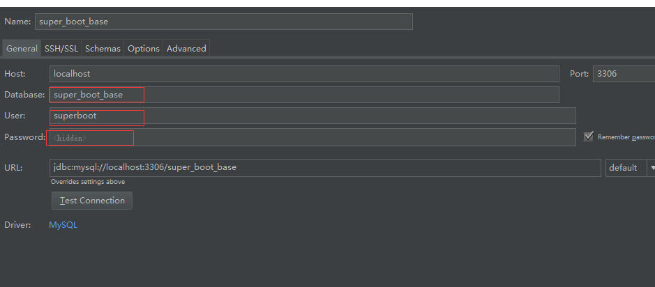
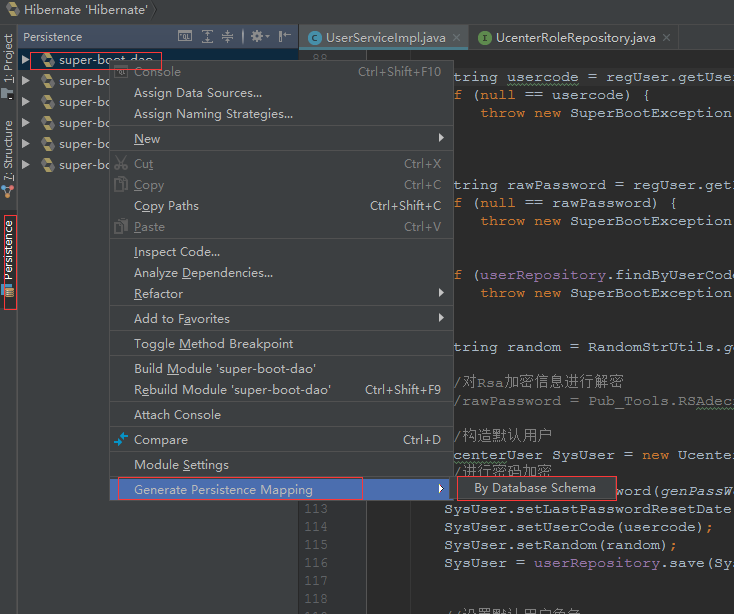
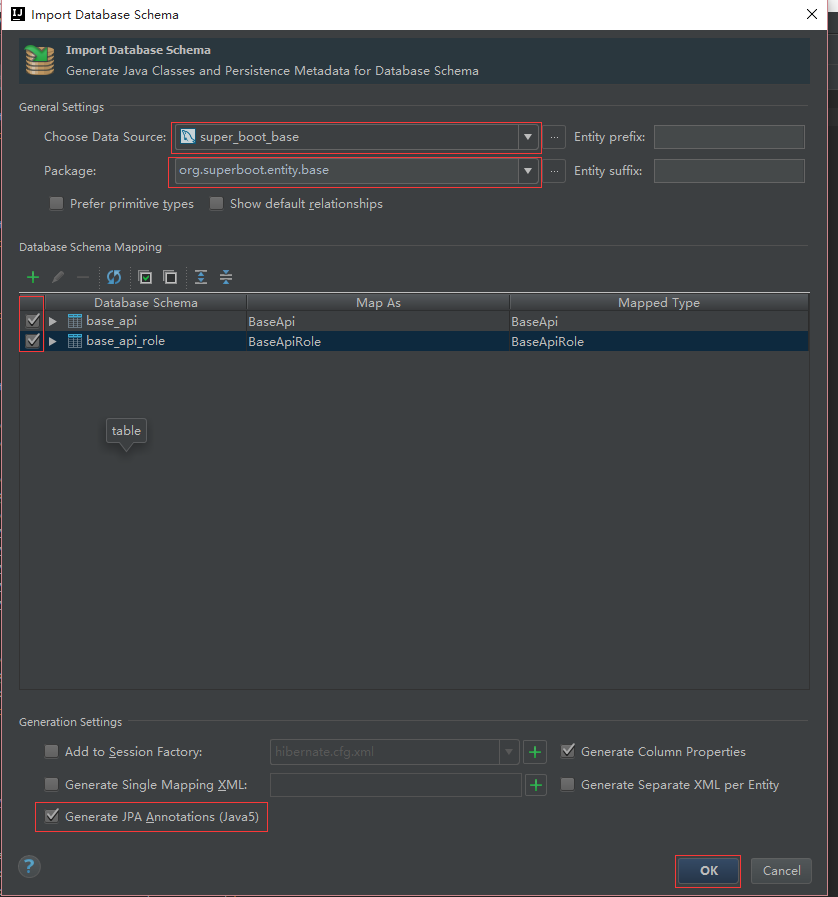
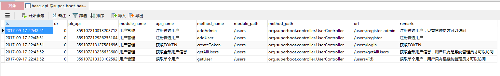
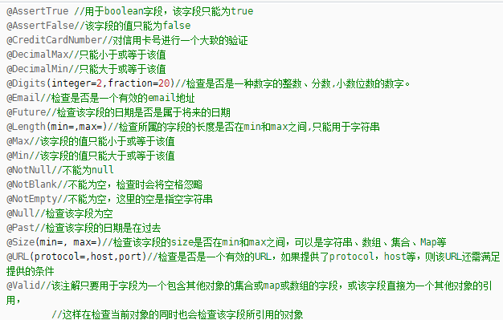

# 项目介绍

[](https://travis-ci.org/7040210/SuperBoot)[](LICENSE)[](https://github.com/7040210/SuperBoot) [](https://github.com/7040210/SuperBoot) 
[](http://isitmaintained.com/project/7040210/SuperBoot "Average time to resolve an issue")
[](http://isitmaintained.com/project/7040210/SuperBoot "Percentage of issues still open")

SuperBoot框架是基于SpringCloud、SpringBoot敏捷开发框架，框架开发初衷是为了方便快速开发项目，无需关心基础代码的编写，可以更专注于业务本身。框架实现基于JWT Token授权验证，实现单点登录SSO，服务鉴权，实现Redis数据缓存，在保证数据一致性的前提下提高接口响应速度。无缝集成MongoDB数据库，提供对非结构型数据存储，解决关系型数据库瓶颈问题。集成swagger框架，实现自动API测试及调试功能，解决程序员最反感的编写技术文档的问题。数据源基于Druid，提供更高性能及SQL监控。框架提供统一异常处理，统一响应结果，增加对JPA、Mongo的AOP拦截，由Snowflake ID自动生成赋值主键，数据实体无需开发均可由Idea自动生成。增删改查默认基于方法名称即可实现，无需写具体SQL。查询支持JPA、QueryDSL、Mybatis等方式。支持数据库读写分离，Feign增加服务直接的安全调用。v01版本是基础学习，主分支基于目前线上功能拆出来的功能模块，实现开箱即用。

如果GITHUB访问较慢，可以访问码云上面的同步代码

https://gitee.com/7040210/SuperBoot


## 项目结构

``` lua
super-boot
├── client-config  		-- 项目配置文件信息，业务模块通过配置中心读取自动配置服务
├── project_info  		--  项目相关信息包含数据字典、SQL语句、工具等
├── super-boot-utils    	--  项目公用工具模块
├── super-boot-base     	--  项目公用常量模块
├── super-boot-global   	--  项目公用全局模块
├── super-boot-registry     --  注册中心
├── super-boot-config       --  配置中心
├── super-boot-gateway      --  网关中心
├── super-boot-user         --  用户中心
```
## 数据流程图
```sequence

客户端->>  网关:提交请求
网关->> 验证身份:身份验证
验证身份-->>客户端:验证未通过
验证身份->>Redis:写入用户信息
网关->> 业务处理:提交业务请求数据
Redis-->>业务处理:获取用户信息
业务处理->>客户端:返回结果数据

```

```sequence


网关->>注册中心:注册服务
微服务->>注册中心:注册服务
配置中心->>注册中心:注册服务
配置中心->>网关:获取配置
配置中心->>微服务:获取配置

客户端->>网关:提交请求
Note right of 网关: 验证用户身份、生成用户Redis信息
网关->>微服务:获取用户信息
微服务->>网关:返回用户信息
网关->>客户端:返回结果数据

```

## 项目依赖

	此分布式项目要求配置人员有相关的从业经验，在启用之前要安装好MongoDB，Zookeeper、Kafka、Mysql、Redis等环境，然后修改项目内的具体配置信息。最后导入db.sql文件到数据库即可。

## 相关账号密码

注册中心及配置中心:

	账号:admin
	
	密码:superboot.org

MYSQL:

	用户:root
	
	密码:root

系统管理员:

	账号:admin
	
	密码:123456

组织管理员:

	账号:group
	
	密码:123456

## 项目启动顺序

  1、启动注册中心（super-boot-registry）
<br>  2、启动配置中心（super-boot-config）
<br>  3、启动网关中心（super-boot-gateway）
<br>  4、启动业务模块（无先后顺序，项目内包含user为用户中心）

## 模块介绍

> super-boot-utils

此模块项目共用工具类及通用方法常量等信息，项目打包的时候会打包为jar包放入项目lib中。


> super-boot-base

此模块项目公用常量信息，项目打包的时候会打包为jar包放入项目lib中。


> super-boot-global

此模块项目公共服务，提供读写分离、缓存、鉴权、多语等一系列功能，项目打包的时候会打包为jar包放入项目lib中。

> super-boot-registry

此模块为注册中心，提供所有服务模块的注册、容错、负载均衡等功能。分布式环境中需要配置为高可用集群模式，要保证注册中心的稳定。
<br>启动后可以访问 http://localhost:10000

> super-boot-config

此模块为配置中心，在分布式环境中需要配置为高可用集群模式，增加安全及稳定性。
<br>启动后可以访问 http://localhost:11000/config-info.yml 

> super-boot-gateway

此模块为API网关中心，提供统一的API调用接口及相关配置功能，支持限流、权限认证等功能。
<br>启动后可以访问 http://localhost:9080/swagger-ui.html

> super-boot-user

此模块为用户中心，提供用户注册、密码修改等相关功能。
<br>启动后可以访问 http://localhost:8090/swagger-ui.html


## Idea逆向生成数据库实体类
### 第一步配置 数据库

### 第二步配置 数据库连接信

### 第三步  配置hibernate，如果没有cfg.xml文件，点击ok后会自动生成

### 第四步 选择hibernate配置文件生成实体

### 第五步 设置完点击，选中要生成的实体的表



## 项目API接口自动添加到数据库示例代码

### 生成效果图


### 使用方式为在启动类添加如下代码即可
~~~~java

	
     @Autowired
    private Pub_DBUtils pub_DBUtils;

    /**
     * 扫描URL，如果数据库中不存在，则保存入数据库
     */
    //这个注解很重要，可以在每次启动的时候检查是否有URL更新，RequestMappingHandlerMapping只能在controller层用。这里我们放在主类中
    @PostConstruct
    public void detectHandlerMethods() {
        pub_DBUtils.addApiToDB();
    }

~~~~

## 项目启用校验国际化功能

### 1、RESTful增加 @Validated 注解

### 2、实体类增加需要校验的注解类型即可

#### 主要用到的注解类型

 


##  Spring Data JPA 为此提供了一些表达条件查询的关键字，大致如下：

#### And --- 等价于 SQL 中的 and 关键字，比如 findByUsernameAndPassword(String user, Striang pwd)

#### Or --- 等价于 SQL 中的 or 关键字，比如 findByUsernameOrAddress(String user, String addr)

#### Between --- 等价于 SQL 中的 between 关键字，比如 findBySalaryBetween(int max, int min)

#### LessThan --- 等价于 SQL 中的 "<"，比如 findBySalaryLessThan(int max)

#### GreaterThan --- 等价于 SQL 中的">"，比如 findBySalaryGreaterThan(int min)

#### IsNull --- 等价于 SQL 中的 "is null"，比如 findByUsernameIsNull()

#### IsNotNull --- 等价于 SQL 中的 "is not null"，比如 findByUsernameIsNotNull()

#### NotNull --- 与 IsNotNull 等价

#### Like --- 等价于 SQL 中的 "like"，比如 findByUsernameLike(String user)

#### NotLike --- 等价于 SQL 中的 "not like"，比如 findByUsernameNotLike(String user)

#### OrderBy ---等价于 SQL 中的 "order by"，比如 findByUsernameOrderBySalaryAsc(String user)

#### Not --- 等价于 SQL 中的 "！ ="，比如 findByUsernameNot(String user)

#### In --- 等价于 SQL 中的 "in"，比如 findByUsernameIn(Collection<String> userList) ，方法的参数可以是 Collection 类型，也可以是数组或者不定长参数

#### NotIn --- 等价于 SQL 中的 "not in"，比如 findByUsernameNotIn(Collection<String> userList) ，方法的参数可以是 Collection 类型，也可以是数组或者不定长参数


## 其他QueryDSL、系统安全、读写分离请参考project-info下具体文档


## 请作者喝杯咖啡吧


